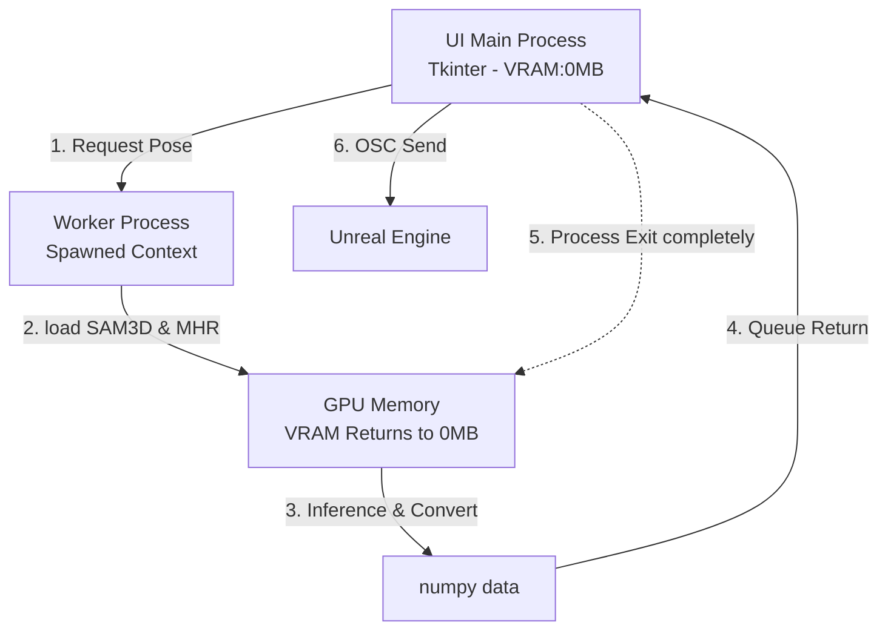

# VibePoser 인수인계 및 아키텍처 문서 (Handover Document)

이 문서는 VibePoser 애플리케이션의 현재 구조, 기술 스택, 모델 정보, 그리고 향후 완전한 메모리 초기화를 달성하기 위한 구조 개선 계획(Architecture Plan)을 정리한 문서입니다. 나중에 작업을 재개하실 때 이 문서를 AI나 개발자에게 제공하면 즉시 문맥을 파악하고 이어서 작업할 수 있습니다.

---

## 1. 기술 스택 (Technical Stack) & 주요 라이브러리
이 프로그램은 **Pixi** 환경에서 실행되며 다음 주요 라이브러리들을 사용합니다:
- **Core:** Python 3.x
- **Deep Learning:** `torch` (PyTorch), `torchvision`
- **Computer Vision:** `opencv-python` (cv2)
- **3D/Math:** `numpy`, `scipy`, `trimesh` (메쉬 처리)
- **GUI:** `tkinter` (기본 UI 프레임워크)
- **Visualization:** `matplotlib` (3D 뷰어)
- **Communication:** `python-osc` (언리얼/VRChat 등 OSC 송출)
- **SMPL Support:** `smplx` (SMPL-X 모델 연산)

---

## 2. 사용 중인 AI 모델 정보
프로그램 실행 경로의 `sam-3d-body-dinov3` 폴더와 `smplx` 폴더에 위치합니다.

1. **SAM 3D Body (포즈 추출)**
   - **파일명:** `model.ckpt`
   - **설명:** 이미지에서 3D 포즈와 메쉬를 추출하는 핵심 엔진 (DINOv3 기반)
2. **MHR (SMPL 변환)**
   - **파일명:** `mhr_model.pt`
   - **설명:** SAM3D의 결과를 표준 SMPL-X 파라미터로 변환해주는 모델
3. **SMPL-X (표준 메쉬 모델)**
   - **파일명:** `smplx/SMPLX_NEUTRAL.npz`
   - **설명:** 변환된 파라미터가 입혀지는 실제 인간 형태의 3D 모델 데이터

---

## 2-1. GitHub 백업 정책 (개인 백업용)
이 저장소는 개인 작업 백업과 세이브포인트 관리를 위한 저장소입니다. 전체 실행 폴더를 그대로 보존하는 목적이 아니라, 직접 수정하는 앱 코드와 환경/인수인계 문서를 안전하게 남기는 목적입니다.

- GitHub 원격 저장소: `https://github.com/dmustud/vibePoser.git`
- 커밋 대상: `pose_app.py`, `pixi.toml`, `pixi.lock`, `VibePoser.bat`, `.gitignore`, `.gitattributes`, 인수인계/작업 로그 문서
- 커밋 제외: `.pixi/`, `logs/`, `backup/`, `__pycache__/`, `sam-3d-body/`, `MHR-main/`, `sam-3d-body-dinov3/`, `smplx/`
- 제외 이유: Meta의 SAM 3D Body 계열 라이브러리, MHR 코드, SMPL-X 모델 파일, 체크포인트(`.ckpt`, `.pt`, `.pkl`, `.npz`)은 외부 라이브러리/대형 모델 자산이며 개인 로컬 환경에서 별도로 준비해서 사용합니다. GitHub에는 불필요하게 올리지 않습니다.

이 프로젝트는 Meta의 SAM 3D Body 라이브러리와 SMPL-X 모델 자산을 로컬에서 이용합니다. 다음 작업자가 환경을 복원할 때는 이 저장소의 코드만으로 완전 실행 환경이 재현된다고 가정하면 안 됩니다. 위 외부 폴더와 모델 파일을 기존 로컬 경로에 다시 배치해야 합니다.

다음 AI/개발자가 구조, 실행 방법, 의존성, 모델 위치, 메모리 정책, Git 백업 정책을 바꾸는 작업을 하면 이 `AGENT.md`도 함께 갱신해야 합니다. 인수인계에 필요하다고 판단되는 내용은 작업자가 알아서 추가해 두는 것을 원칙으로 합니다.

---

## 3. 프로그램 목적 및 현재 아키텍처
**목적:** 단일 이미지에서 3D 포즈(SAM3D)를 추출하고, 이를 SMPL 포즈 데이터(MHR)로 변환한 후 언리얼 엔진 등(OSC)으로 실시간 전송하는 파이썬 기반 GUI 프로그램

**현재 파이프라인 (단일 파이썬 프로세스로 구동):**
1. **Tkinter GUI:** 사용자가 이미지를 올리고 버튼을 누름.
2. **포즈 추출 (Button 1):** `SAM3DBody` 모델(Meta 내부 DINOv3 사용)이 2D 이미지 좌표와 깊이 추론. (필요 VRAM: ~1GB)
3. **SMPL 변환 (Button 2):** 추출된 파라미터를 기반으로 `MHR_smpl` 모델을 가동하여 SMPL 메쉬와 Joint Rotation을 생성. (필요 VRAM: ~4GB)
4. **결과 전송 (OSC):** 생성된 파라미터를 포장하여 UDP 소켓으로 외부 송출.

---

## 4. 메모리 누수(Memory Leak) 이슈의 본질 (현재 상태)
이해를 돕기 위해 현재 왜 `del` 명령자로 파이토치(PyTorch) 모델을 지우는 기능을 빼고 켜둔 채 유지(Pinning)하도록 타협했는지 설명합니다.

* **발생했던 버그:** 메모리를 확보하려고 "변환할 때마다 모델을 불러오고, 끝나면 지우는(`del model`)" 방식을 사용했더니, 작업관리자의 메모리(System RAM)와 VRAM이 1회 실행마다 **약 665MB씩 누적 증가**하여 결국 컴퓨터가 터지는 증상이 있었습니다.
* **근본 원인:** SAM3D 내부에 장착된 **DINOv3의 `torch.hub` 아키텍처** 특성 때문입니다. 파이썬 단일 프로세스 내에서 이 녀석들은 모델 객체의 이름만 지울 뿐, 보이지 않는 전역 캐시(Global CUDA Context Registry)에는 찌꺼기를 계속 남깁니다. 그래서 두 번 지우고 두 번 부르면 동일한 모델이 두 개 겹쳐서 메모리를 파먹는 치명적인 파이토치 고질병입니다.
* **현재 임시 조치 사항:** 모델을 지우는 로직을 완전히 제거했습니다. 처음에 한 번 로딩되면 컴퓨터 메모리에 **계속 띄워놓고 재사용(Cache)** 하도록 코드를 돌려놨습니다.
  * **장점:** 초기 1회성으로 5~6GB의 VRAM만 점유하고, 이후 100번을 돌려도 메모리가 평행선을 유지하며 더 이상 오르지 않습니다 (누수 차단).
  * **단점:** 앱을 켜두는 내내 배경에서 5~6GB의 메모리를 묵직하게 잡아먹고 있어야 합니다 (언리얼과 동시 사용 시 부담).

### 2026-06-17 안정화 패치 메모
현재 구조는 여전히 단일 프로세스이지만, GUI 안정성을 위해 다음 안전장치를 추가했습니다.

- Tkinter 위젯/변수/Matplotlib canvas 갱신은 `run_on_ui(...)`를 통해 메인 UI 스레드로 넘깁니다.
- 웹캠 전환 시 이전 캡처 루프가 중복 실행되지 않도록 `webcam_generation`, `webcam_lock`, `webcam_thread`로 세대 관리를 합니다.
- 웹캠 프레임 UI 예약이 과도하게 쌓이지 않도록 프레임 대기 플래그를 둡니다.
- 포즈 추론은 시작 시점의 `current_image` 복사본을 사용해 웹캠 프레임 갱신과의 경합을 줄입니다.
- 슬라이더 회전 변경 시 OSC를 즉시 매번 전송하지 않고 150ms debounce 후 한 번만 전송합니다.
- debounce된 OSC 전송은 UI 스레드에서 슬라이더/체크박스 값을 캡처한 뒤 별도 스레드에서 계산/송출합니다.

다음 최적화 단계는 `self.smpl_result`를 GPU 텐서 대신 CPU 캐시로 보관하는 작업과, 장기적으로 PyTorch 추론/변환을 별도 worker process로 분리하는 작업입니다.

---

## 5. 향후 계획: Multiprocessing 도입 (완벽한 메모리 제로화)
나중에 "추출/변환할 때만 메모리를 빨아먹고 평소에는 완전히 0으로 돌려놓기" 위해 적용해야 할 궁극적인 아키텍처 다이어그램 및 설계도입니다.

**[해결 로직: 샌드박스 격리 (Subprocess)]**
현재처럼 UI 프로그램 안에서 파이토치를 같이 수입(`import`)해서 쓰면 안 됩니다.
**본체(GUI)**는 껍데기만 남겨 가볍게 띄워두고, 버튼을 누를 때마다 **일회용 파이토치 작업꾼(Process)**을 새로 생성하여 변환을 시킨 뒤 작업꾼 자체를 총살시켜버리는(OS System Kill) 방식입니다. 이러면 윈도우 OS 시스템 레벨에서 찌꺼기 포인터들까지 100% 강제 수거해 갑니다.

### 예정된 프레임워크 변경 설계도

### 적용에 필요한 작업들 (To-Do List for Future AI)
1. **`pose_app.py` 분리 작업:** 기존 모놀리식 구조에서, 무거운 파이토치 코드들을 `heavy_worker.py` 같은 별도의 스크립트로 분리.
2. **`multiprocessing` 라이브러리 도입:** UI 버튼을 누르면 `multiprocessing.Process` 또는 `subprocess.Popen`을 실행.
3. **통신 규격(Pipe/Queue) 구축:** 작업꾼 프로세스가 완료된 순수한 파이썬 배열 리스트(`numpy` / `dict`)만 메인 UI로 던져줌.
4. **에러 핸들링:** 작업꾼 내부에서 CUDA Out Of Memory 에러가 나더라도 UI 본체가 튕기지 않고 메시지를 안전하게 넘겨받도록 설계.

*(이 문서를 다음 작업 단계에서 AI에게 복사해 주시면, 이어서 바로 독립 프로세스 아키텍처 리팩토링을 시작할 수 있습니다.)*
